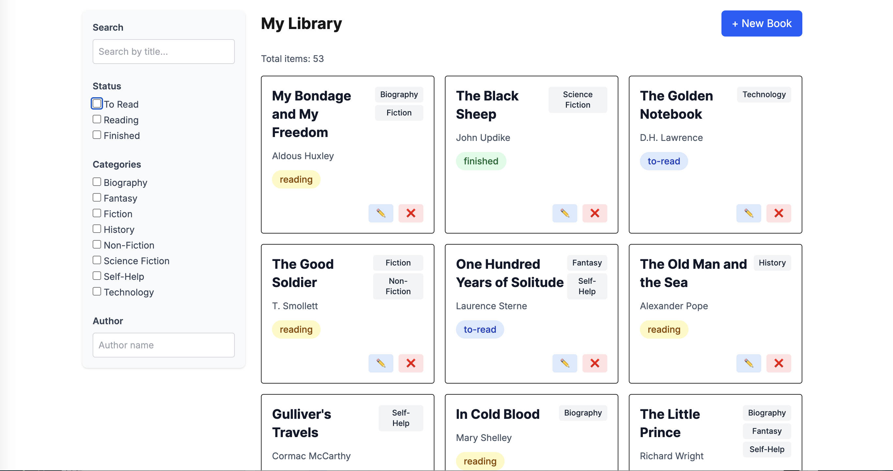

# 📚 BookShelf App




BookShelf is a modern full-stack web app built with React and Next.js, designed as a side project to deepen my understanding of full-stack TypeScript development. It demonstrates best practices in UI/UX, serverless architecture, and component design.

---

## ✨ Features

- ✅ Responsive, mobile-first design
- ✅ Search and filtering by title, author, status, and category
- ✅ Pagination
- ✅ Edit and delete with optimistic UI and undo support
- ✅ Serverless PostgreSQL via Neon.tech (Vercel integration)
- ✅ React Context + custom hooks for state management
- ✅ Toast notifications with react-hot-toast
- ✅ Prisma ORM with PostgreSQL
- ✅ Full API integration with Next.js route handlers
- ✅ Docker support for local Postgres development
- ✅ TypeScript-first architecture

---

## 🌍 Live Demo

Visit the app at: [https://bookshelf-app-iota-jade.vercel.app/books](https://bookshelf-app-iota-jade.vercel.app/books)

---

## 🚀 Getting Started

### 📦 Prerequisites

- Node.js >= 18
- Docker + Docker Compose
- pnpm / npm / yarn (your preference)
- Optional: A Neon Postgres DB for cloud deployment

### 🔧 Local Development Setup

1. Clone the repo:
   ```bash
   git clone https://github.com/jcastiarena/bookshelf-app.git
   cd bookshelf-app
   ```

2. Install dependencies:
   ```bash
   npm install
   ```

3. Set up environment variables:
   ```bash
   cp .env.example .env
   ```

4. Launch local Postgres using Docker:
   ```bash
   docker-compose up -d
   ```

5. Generate Prisma client and run migrations:
   ```bash
   npx prisma generate
   npx prisma migrate dev --name init
   ```

6. Seed the database (optional):
   ```bash
   npm run seed
   ```

7. Start the dev server:
   ```bash
   npm run dev
   ```

Open [http://localhost:3000](http://localhost:3000) to explore the app.

---

## 🧪 Run tests (coming soon)

```bash
npm test
```

---

## 📅 Roadmap

- 🔐 Login and session handling (Auth.js or NextAuth)
- 🏠 Landing page at `/` with navigation to `/books`
- 📚 Google Books API integration to import books
- 📊 Analytics dashboard for reading habits (e.g., by genre, time)
- 🧾 Book reading logs or notes
- 🏷️ Tag system for custom labels
- 🔁 Infinite scroll for book list
- 🌙 Dark mode toggle
- 🧪 Unit and integration tests with Jest and React Testing Library
- 🚥 GitHub Actions for CI/CD (test + deploy)
- 🖼️ Upload book covers (image handling)
- 🔍 Server-side search and debounce for improved UX

---

## 🔧 Tech Stack

- React 18
- Next.js App Router
- Tailwind CSS
- Prisma ORM
- PostgreSQL (local via Docker or cloud via Neon)
- TypeScript
- React Context
- Vercel (for production deployment)

---

## 🧠 Inspiration

This app was created as a personal learning project to explore full-stack TypeScript and serverless development with modern tools. It serves as a foundation for trying out UI patterns, clean architecture, and modern tooling in a real-world-feeling app.

Feel free to fork, contribute, or suggest improvements!
